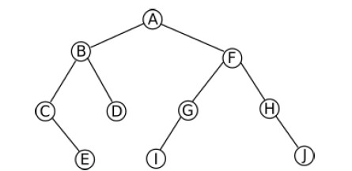

# 2. Arbres

Les arbres sont des types abstraits très utilisés en informatique. Ce sont des structures de données ^^**non linéaires**^^. On les utilise notamment quand on a besoin d'une **structure hiérarchique** des données.

Un arbre est constitué :

- d'une racine

- de nœuds , sommets intermédiaires de l'arbre

- de feuilles: sommets "finaux" de l'arbre

- et de branches, qui relient les éléments précédents entre eux

## 2.1. Parcourir un arbre

### 2.1.1 Principe

On part de la racine en posant toujours sa main gauche sur une branche, et on avance en laissant celle-ci posée. On passe par ce principe par tous les nœuds de l'arbre. Cette forme de parcours sur les arbres binaires s’appelle **le parcours en profondeur main gauche**.

Application: sortir d'un labyrinthe.

### 2.1.2 Parcours


L’ordre dans lequel est fait ce traitement donne trois parcours possibles :

=== "1. Parcours préfixe"

    **Ordre préfixe** : Descente vers le sous-arbre gauche.

    Vérifiez que l’arbre est bien parcouru dans l’ordre suivant :
    **A, B, C, E, D, F, G, I, H, J**

=== "2. Parcours infixe"

    **Ordre infixe** : Passage du sous-arbre gauche au sous-arbre droit.

    Vérifiez que l’arbre est bien parcouru dans l’ordre suivant :
    **C, E, B, D, A, I, G, F, H, J**

=== "3. Parcours suffixe (ou postfixe)"

    **Ordre suffixe (ou postfixe)** : Remontée depuis le sous-arbre droit.

    Vérifiez que l’arbre est bien parcouru dans l’ordre suivant :
    **C, E, D, B, I, G, J, H, F, A**

??? tip "Parcourir un arbre en largeur"
    Ce parcours aussi qualifié de _**hiérarchique**_ est par nature **itératif**

    ^^Principe :^^ on parcourt tous les noeuds de hauteur 1 (la racine), puis tous les noeuds de hauteur 2, ceux de hauteur 3 etc. Le parcours se fait en général de gauche à droite.
    
    On dit alors que le parcours se fait, en fait, par _hauteur_ (_profondeur_) par rapport à la racine.

    

    Vérifier que l'arbre ci-dessous est bien parcouru en largeur dans l'ordre suivant : **A, B, F, C, D, G, H, E, I, J**

---

## 2.2. Arbre binaire

Un arbre est dit _binaire_ lorsque tout les noeuds sont d'**arité** au maximum égal à **2** (1)
{ .annotate }

1.  **C'est à dire :** les noeuds peuvent avoir au maximum 2 branches

### 2.2.1 Algorithme

```py title="Taille" linenums="1"
def taille (self):
    ''' retourne la taille de l'arbre avec méthode récursive'''
    TailleG = 0
    TailleD = 0
    if self.gauche != None :
            TailleG = self.gauche.taille()
    if self.droit != None :
            TailleD = self.droit.taille()
    return 1 + TailleG + TailleD
```
```py title="Hauteur" linenums="1"
def hauteur (self):
    ''' retourne la hauteur de l'arbre avec méthode récursive'''
    HauteurG = 0
    HauteurD = 0
    if self.gauche != None :
            HauteurG = self.gauche.hauteur()
    if self.droit != None :
            HauteurD = self.droit.hauteur()
    return 1 + max( HauteurG , HauteurD)
```
```py title="Est une feuille" linenums="1"
def est_feuille(self):
    ''' retourne booléen si le noeud (sous arbre) est une feuille'''
    return self.gauche == None and self.droit == None
```
```py title="Compte feuilles" linenums="1"
def compte_feuilles(self):
    ''' Retourne le nombre de feuilles'''
    CptFG = 0
    CptFD = 0
    if self.est_feuille():
        return 1
    if self.gauche != None :
            CptFG = self.gauche.compte_feuilles()
    if self.droit != None :
            CptFD = self.droit.compte_feuilles()
    return CptFG + CptFD
```

---

## 2.3. Arbre Binaire **de Recherche** (ABR)
Un arbre binaire de recherche est un cas particulier d'arbre binaire.

Pour avoir un arbre binaire de recherche :

- il faut avoir un arbre binaire !

- il faut que les clés de noeuds composant l'arbre soient ordonnables (on doit pouvoir classer les noeuds, par exemple, de la plus petite clé
à la plus grande)

- soit x un noeud d'un arbre binaire de recherche. La clé de son sousarbre gauche est inférieure à la clé du sommet et la clé de son sousarbre droit est supérieur à la clé du sommet

!!! info "Remaque"
    Dans un ABR, pour un sommet quelconque, **toutes** les clés de son sous-arbre **gauche** sont **inférieure** à la clé de son sommet et **toutes** les clés de son sous-arbre **droit** son **supérieures** à la clé de son sommet.

En programmation, on utilise le parcours **infixe** pour parcourir l'arbre dans l'ordre croissant.

### 2.3.1 Aglorithmes

```py title="parcours infixe" linenums="1"
def parcoursInfixe(arbre):
    if arbre is None :
        return
    parcoursInfixe(arbre.gauche)
    print(arbre.etiquette, end=' ')
    parcoursInfixe(arbre.droit)
```
```py title="recherche ABR" linenums="1"
def recherche_ABR(arbre, valeur):
    if arbre is None :
        return False

    if arbre.etiquette == valeur :
        return True

    if valeur < arbre.etiquette :
        return recherche_ABR(arbre.gauche, valeur)
    else:
        return recherche_ABR(arbre.droit, valeur)
```
```py title="insertion ABR" linenums="1"
def insertion_ABR(arbre, valeur):
if arbre is None :
    return Arbre_binaire(valeur)
elif valeur <= arbre.etiquette :
    arbre.gauche = insertion_ABR(arbre.gauche, valeur)
else:
    arbre.droit = insertion_ABR(arbre.droit, valeur)
return arbre
```